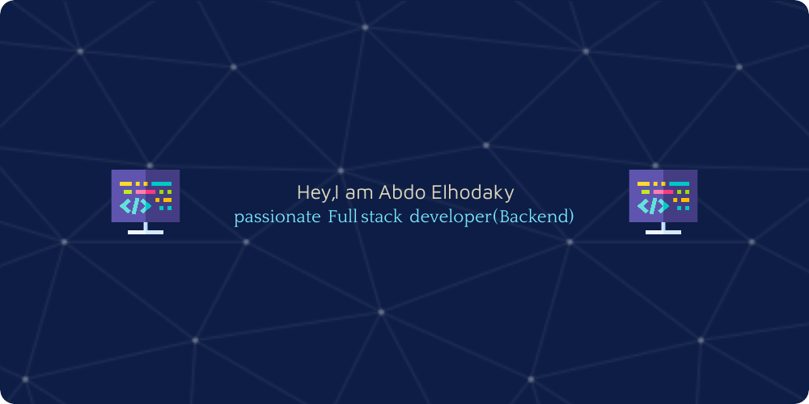

 

- 🌱 I’m currently learning **Blockchain**

- 📫 How to reach me **abdo_elhodaky@yahoo.com,abdo_elhodaky@outlook.com**,(https://wa.me/+201141894373)

- 📄 Know about my experiences [Vist](
  https://linkedin.com/in/abdelrhman-elhodaky-9521bb220)

<h3 align="left">Connect with me:</h3>

<h3>Request my services:</h3>

  

# 💻 Tech Stack:
                                                       
# 📊 GitHub Stats:
 
 

## 🏆 GitHub Trophies

### ✍️ Random Dev Quote

### 🔝 Top Contributed Repo

---

<!-- Proudly created with GPRM ( https://gprm.itsvg.in ) -->
